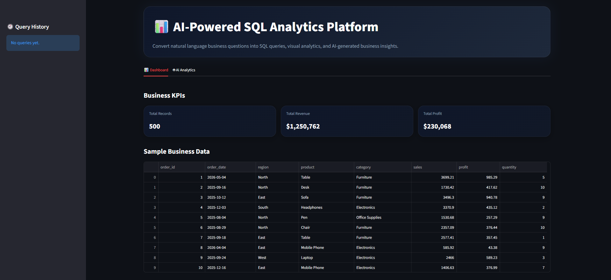
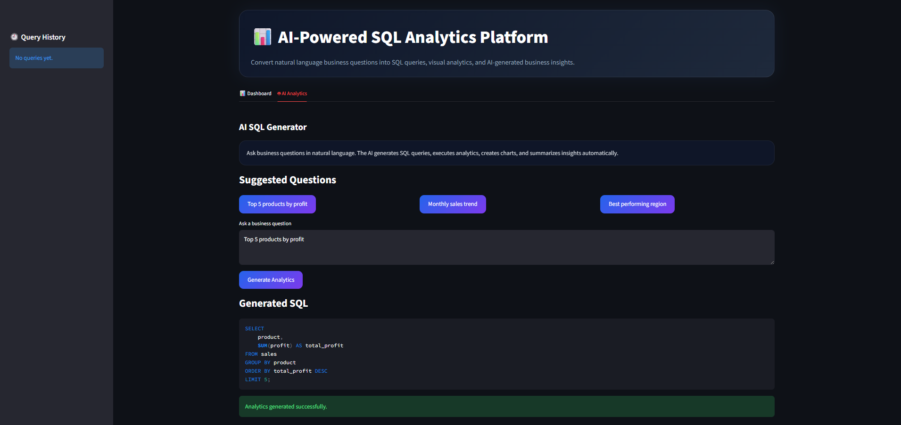
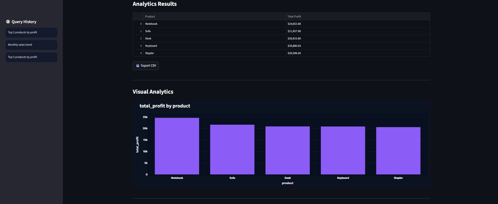
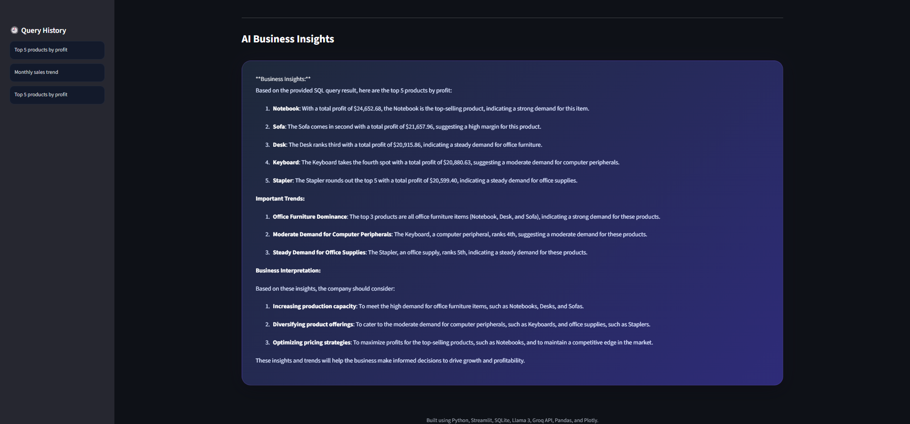

# 🚀 AI-Powered SQL Analytics Copilot

An enterprise-style AI analytics platform that converts natural language business questions into SQL queries, interactive visualizations, KPI dashboards, and AI-generated business insights.

---

## 📌 Project Overview

This project simulates a modern AI-powered Business Intelligence platform where users can ask business questions in plain English and receive:

- AI-generated SQL queries
- Interactive analytics dashboards
- Automated visualizations
- Business insights powered by LLMs
- Downloadable analytics results
- Real-time KPI summaries

---

# 📸 Application Preview

## 🏠 Dashboard

<p align="center">
  
</p>

---

## 🤖 AI Query Generation

<p align="center">
  
</p>

---

## 📊 Visual Analytics

<p align="center">
  
</p>

---

## 🧠 AI Business Insights

<p align="center">
  
</p>

---

# ✨ Features

- Natural Language to SQL
- Automated Visual Analytics
- KPI Dashboard
- AI Business Insights
- CSV Export
- Query History
- Loading Animations

---

# 🛠️ Tech Stack

| Technology | Purpose |
|---|---|
| Python | Backend Logic |
| Streamlit | Web App |
| SQLite | Database |
| Pandas | Data Processing |
| Plotly | Visualization |
| Groq API | LLM Integration |
| Llama 3 | AI Query Generation |

---

# 📂 Project Structure

```text
AI-SQL-Analytics-Copilot/
│
├── app.py
├── charts.py
├── database.py
├── ai_engine.py
├── requirements.txt
├── README.md
└── assets/
```

---

# ⚙️ Run Locally

```bash
pip install -r requirements.txt
streamlit run app.py
```

---

# 📊 Example Queries

```text
Top 5 products by profit
Monthly sales trend
Best performing region
```

---

# 🎨 UI Highlights

- Premium dark analytics dashboard
- Gradient enterprise cards
- Rounded chart containers
- Interactive Plotly charts


---

# 🚀 Future Improvements

- PDF export
- Authentication
- Real-time analytics

---

# ⭐ Support

If you found this project useful, consider giving it a ⭐ on GitHub.
